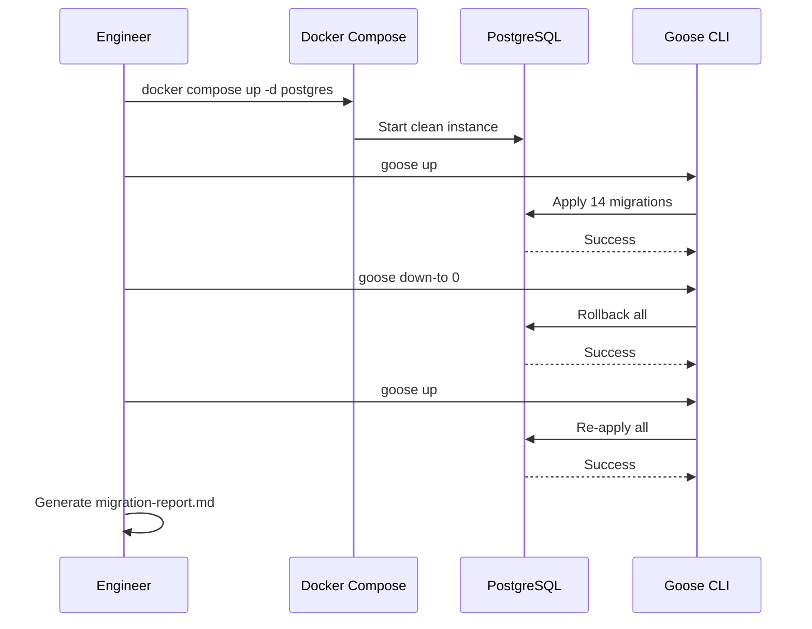

# Phase 2: V1 发布验证 Design

## Overview

本阶段按照 release-checklist-v1.md 的 6 个类别、30 项检查逐一执行验证，产出 migration-report.md 和 regression-matrix-v1.md 两个发布产物，并更新 release-checklist-v1.md 和 release-gate-v1.md。

## Requirement Coverage (RQ -> DSN)

| Requirement ID | Covered By Design IDs | Notes |
|----------------|-----------------------|-------|
| RQ-001 | DSN-001 | API 端点对比 |
| RQ-002 | DSN-002 | 迁移验证流程 |
| RQ-003 | DSN-003 | 回归测试执行 |
| RQ-004 | DSN-004 | 可观测性检查 |
| RQ-005 | DSN-005 | 回滚验证 |
| RQ-006 | DSN-006 | 发布决策更新 |

---

## Design Index

| Design ID | Element | Type | Notes |
|-----------|---------|------|-------|
| DSN-001 | API 合约对比流程 | workflow | 对比代码路由与文档 |
| DSN-002 | 迁移验证流程 | workflow | Docker Compose + goose |
| DSN-003 | 回归矩阵执行 | workflow | Go test + npm test + 功能验证 |
| DSN-004 | 可观测性检查 | workflow | trace/log/runbook 验证 |
| DSN-005 | 回滚验证 | workflow | CI Postgres db:rollback |
| DSN-006 | 发布决策更新 | data | release-gate-v1.md 更新 |

---

## DSN-001: API 合约对比流程

**Type:** workflow

**Purpose:** 确认服务器注册的路由与 OpenAPI 规范及文档一致。

**Covers Requirements:** RQ-001

**Responsibilities:**
- 从 `cmd/server/main.go` 提取所有注册的 HTTP 路由
- 与 `openapi/openapi.v1.yaml` 对比
- 标记缺失或不一致的端点
- 检查请求/响应结构是否与处理函数签名匹配

---

## DSN-002: 迁移验证流程

**Type:** workflow

**Purpose:** 在干净 PostgreSQL 中验证完整的迁移生命周期。

**Covers Requirements:** RQ-002

**Responsibilities:**
1. 启动干净 PostgreSQL 容器
2. 执行 `goose up` 应用全部 14 个迁移
3. 验证所有表已创建
4. 执行 `goose down-to 0` 回滚全部迁移
5. 再次执行 `goose up` 验证重新应用
6. 检查核心表结构完整性
7. 生成 `docs/release-artifacts/migration-report.md`

---

## DSN-003: 回归矩阵执行

**Type:** workflow

**Purpose:** 执行全部回归测试并记录结果。

**Covers Requirements:** RQ-003

**Responsibilities:**
1. 执行 `go test ./...` 并记录结果
2. 执行 `npm --prefix web run test -- --run` 并记录结果
3. 通过 CLI 或 API 执行 Agent 基本流程
4. 验证多模态流程（需 mock provider）
5. 验证 Flow 编排 create/bind/run
6. 验证 Debugger list/detail/cost
7. 验证 Marketplace create/review/rate/apply
8. 执行 `scripts/benchmark.sh` 生成报告
9. 汇总结果到 `docs/release-artifacts/regression-matrix-v1.md`

---

## DSN-004: 可观测性检查

**Type:** workflow

**Purpose:** 验证追踪链路和日志在请求链中正常工作。

**Covers Requirements:** RQ-004

**Responsibilities:**
- 发起带 trace header 的请求，验证 Trace ID 传播
- 检查 Agent run 的 timeline 事件记录
- 触发错误路径，验证日志输出
- 按 runbook 步骤操作，验证可复现性

---

## DSN-005: 回滚验证

**Type:** workflow

**Purpose:** 在 CI Postgres 环境验证 db:rollback 自动化。

**Covers Requirements:** RQ-005

**Responsibilities:**
- 在 CI 环境执行 `a2ui-cli db:rollback 3`
- 验证 00014 -> 00013 -> 00012 顺序回退
- 检查回退后数据库状态
- 关闭 RISK-001

---

## DSN-006: 发布决策更新

**Type:** data

**Purpose:** 更新 release-gate-v1.md 和 release-checklist-v1.md。

**Covers Requirements:** RQ-006

**Responsibilities:**
- 逐项勾选 release-checklist-v1.md 的 30 个 checkbox
- 更新 release-gate-v1.md 的 Decision 字段
- 记录 Product sign-off 状态

---

## Sequence Flows

### Flow 1: 迁移验证

---

## Operational Considerations

### Rollout / Rollback
- 本阶段为验证性工作，不涉及生产部署
- 产出物为文档更新

### Observability
- 验证过程本身的日志保存在 CI artifacts 中
