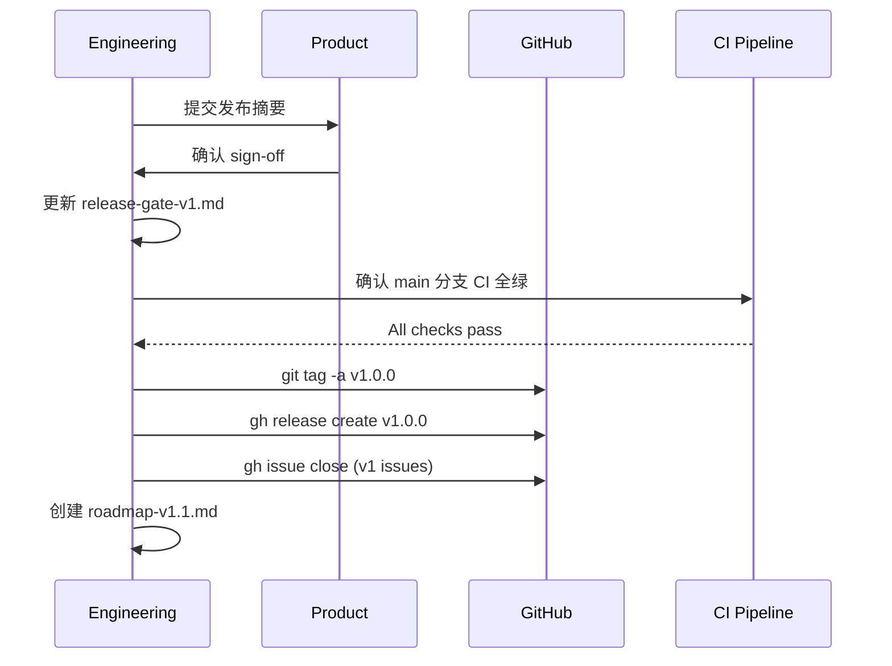

# Phase 4: 收尾与 V1 正式发布 Design

## Overview

本阶段是发布流水线的最后一环。在技术验证（Phase 2）和质量补全（Phase 3）完成后，执行发布决策确认、版本标记、产物归档和后续规划。

## Requirement Coverage (RQ -> DSN)

| Requirement ID | Covered By Design IDs | Notes |
|----------------|-----------------------|-------|
| RQ-001 | DSN-001 | Product sign-off 流程 |
| RQ-002 | DSN-002 | 版本标记流程 |
| RQ-003 | DSN-003 | Changelog 生成 |
| RQ-004 | DSN-004 | 产物归档检查 |
| RQ-005 | DSN-005 | v1.1 规划文档 |
| RQ-006 | DSN-006 | Issue 清理 |

---

## Design Index

| Design ID | Element | Type | Notes |
|-----------|---------|------|-------|
| DSN-001 | Product sign-off 流程 | workflow | 人工确认 + 文档更新 |
| DSN-002 | 版本标记流程 | workflow | git tag + GitHub Release |
| DSN-003 | Changelog 生成策略 | workflow | 基于 commit + spec 汇总 |
| DSN-004 | 产物归档检查 | workflow | 文件存在性 + 内容完整性 |
| DSN-005 | v1.1 规划文档 | data | 延后项清单 |
| DSN-006 | Issue 清理流程 | workflow | gh issue close |

---

## DSN-001: Product sign-off 流程

**Type:** workflow

**Purpose:** 获取 Product 团队对 v1 发布的正式确认。

**Covers Requirements:** RQ-001

**Responsibilities:**
1. 准备发布摘要（功能列表、已知风险、延后项）
2. 提交给 Product 负责人审阅
3. 获取确认后更新 release-gate-v1.md：
   - Product 行：`done / {date}`
   - Decision：`released`

---

## DSN-002: 版本标记流程

**Type:** workflow

**Purpose:** 在 main 分支创建正式版本标记。

**Covers Requirements:** RQ-002

**Responsibilities:**
1. 确认 main 分支 CI 全绿
2. 创建 annotated tag：`git tag -a v1.0.0 -m "Release v1.0.0"`
3. 推送 tag：`git push origin v1.0.0`
4. 通过 `gh release create` 创建 GitHub Release

---

## DSN-003: Changelog 生成策略

**Type:** workflow

**Purpose:** 生成结构化的版本变更日志。

**Covers Requirements:** RQ-003

**Responsibilities:**
- 从 release-notes-v1-rc.md 提取核心功能列表
- 从 git log 提取 commit 摘要
- 按分类组织：
  - **Features**: Agent Pipeline, Flow Orchestration, Multimodal, Debugger, Marketplace, Provider Pool, etc.
  - **Infrastructure**: PostgreSQL, Docker, CI/CD, Observability
  - **Security**: Guardrail, Secrets Governance, Injection Detection
  - **Enterprise**: RBAC, Audit, Cost Governance (baseline)
  - **Known Limitations**: SSO/SCIM 501, CLI stubs, placeholder pages

---

## DSN-004: 产物归档检查

**Type:** workflow

**Purpose:** 确认所有发布产物文件完整。

**Covers Requirements:** RQ-004

**Responsibilities:**
- 检查文件存在性：
  - `docs/release-artifacts/release-gate-v1.md`
  - `docs/release-artifacts/migration-report.md`
  - `docs/release-artifacts/regression-matrix-v1.md`
  - `docs/release-artifacts/release-notes-v1-rc.md`
- 检查内容非空且格式正确
- 确认 release-checklist-v1.md 30 项已勾选

---

## DSN-005: v1.1 规划文档

**Type:** data

**Purpose:** 记录所有从 v1 延后到 v1.1 的工作项。

**Covers Requirements:** RQ-005

**Responsibilities:**
- 创建 `docs/roadmap-v1.1.md`
- 包含以下延后项：

| 项目 | 优先级 | 估算 |
|------|--------|------|
| Go SDK 客户端 | high | 1 周 |
| TypeScript SDK 客户端 | high | 1 周 |
| 企业 SSO/SCIM 实现 | medium | 2 周 |
| CLI backup/restore 真实实现 | medium | 3 天 |
| CLI data:export/import 真实实现 | medium | 3 天 |
| Workspaces 页面功能化 | medium | 1 周 |
| Playground 页面功能化 | medium | 1 周 |
| Sessions 页面功能化 | low | 3 天 |
| Editor 页面功能化 | low | 1 周 |
| Settings 页面功能化 | low | 3 天 |
| Canvas 预览真实渲染器 | high | 2 周 |

---

## DSN-006: Issue 清理流程

**Type:** workflow

**Purpose:** 关闭所有 v1 范围内已完成的 GitHub Issue。

**Covers Requirements:** RQ-006

**Responsibilities:**
1. 列出所有 open issue：`gh issue list --state open`
2. 对 v1 范围内已完成的 issue 执行 `gh issue close`
3. 对 Issue #11（队列不一致）添加修复说明并关闭
4. 对延后到 v1.1 的 issue 添加 `v1.1` label

---

## Sequence Flows

### Flow 1: 发布流程

---

## Operational Considerations

### Rollout / Rollback
- 如果发布后发现严重问题，按 release-gate-v1.md 中的 Rollback Plan 执行
- 回退到前一稳定镜像，按 00014 -> 00013 -> 00012 顺序执行 down SQL

### Observability
- 发布后 24 小时内密切监控 5xx 率和迁移后数据完整性
